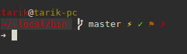
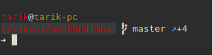
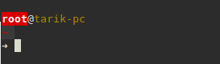
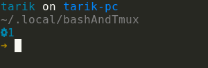
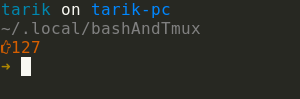
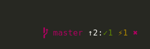
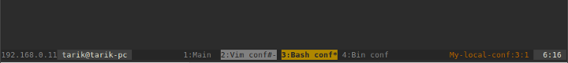
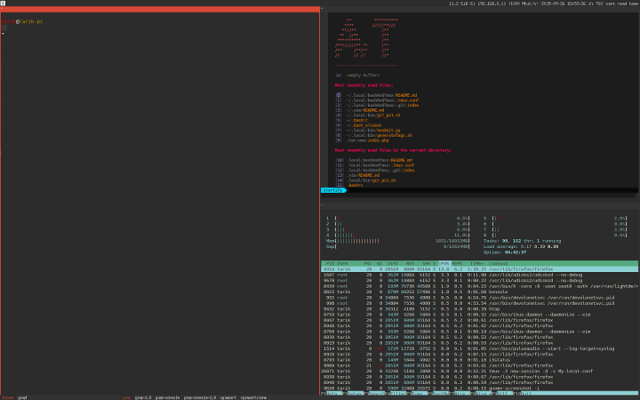

# Conf

Configuration files for some things

## Install

Launch install.sh script,
It create symlinks in your home.

## Git

### Some aliases
* pretty log with lg
* `ci` for `commit`
* `co` for `checkout`
* `st` for status without untracked files
* `dw` & `dws` for `diff --color-words` unstaged files or not
* `rh` & `rhh` for reset head and reset head --hard
* `gitdiff` for git diff in a watch refreshing every 2 seconds
* `gitst` same but for status

### Other
Create a template commit message in your home.
This configuration need it.

## Bash

### Prompt

#### Status git:
* ⚡ for tracked modified files
* ✓ for added to stage files
* ✗ for untracked files
* ⚑ for stash list
* ↗ for local are ahead from remote
* ↖ for local are behind from remote
* ⤧ local and remote have diverged

### Sourced
List of some sourced ressources, mainly for completion on mac OS(need brew), debian and centos.
* bash_completion
* git-prompt
* bash_completion_tmux

### Aliases
I'm not listing all but see some significants i think
* `c` for `cd`
* `l` for `ls -lFh --group-directories-first`
* `g` for `grep -n --color=auto`
* `cp`, `mv` & `rm` need confirm on overwrite
* `vi` for `vim -u NONE`, no plugins no vimrc

### Other

User root displayed on red background, maximum stress guaranty!

## Zsh

### Prompt
*  for jobs run in background
*  with error code when happen

#### Status git:

* ⚡ for tracked modified files
* ✓ for added to stage files
* ✖ for untracked files
* ✖ for conflict files
* ⚑ for stash list
* ↑ for local are ahead from remote
* ↓ for local are behind from remote
*  for clean working directory, you take a break

### Aliases
* same as bash list above
* `rz` reload zsh config file

## Tmux

* Prefix 'a'
* Shorten delay between tmux command
* Panes label are centered
* Panes start to index 1 instead 0
* In status bar you find
    * on the left
        * ip (ifconfig inet)
        * user and host
    * on the right
        * session tmux name
        * and time

### Aliases
* `<c-a>r` to refresh tmux conf
* `<c-a>m` to enable mouse mode
* `<c-a>M` to disable mouse mode (paste with middle mouse click will work)
* `tls` in bash, list session tmux
* `t` eq `tmux -u -2`
* `tt` eq `tmux -u -2 attach -d`

## I3

* Use 'super key' as prefix
* Status bar is on the top

### Aliases
* Launching konsole with `mod+return`
* Kill focused window `mod+Shift+q`
* You can change focus with same vim arrows (jkl)
* Fullscreen mode `mod+f`
* Reload i3 conf file `mod+Shift+c`
* …
